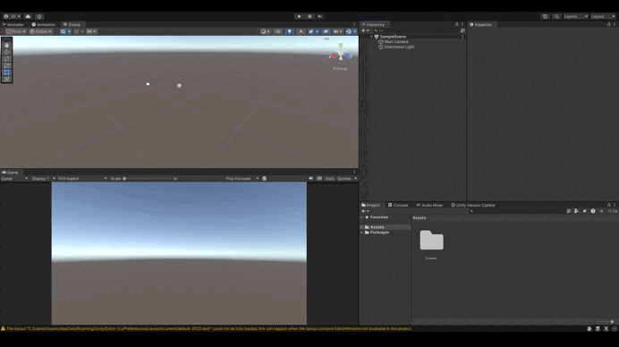
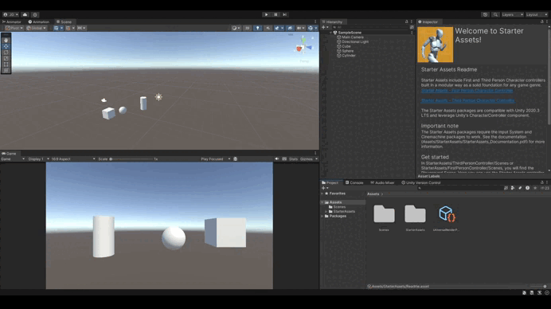
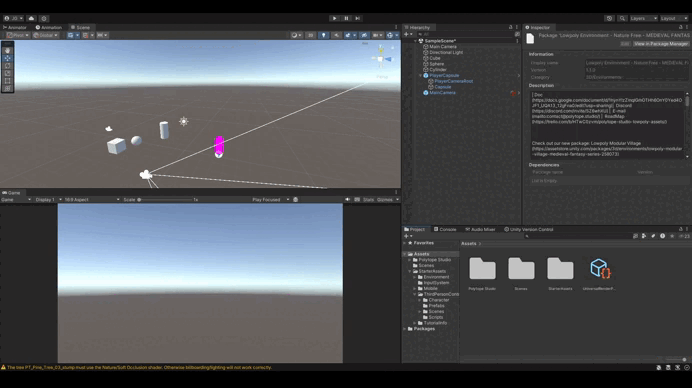
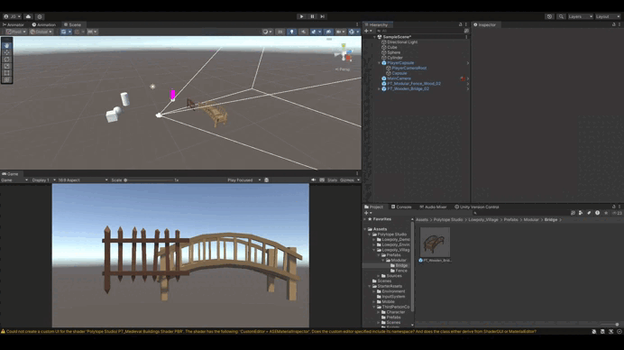
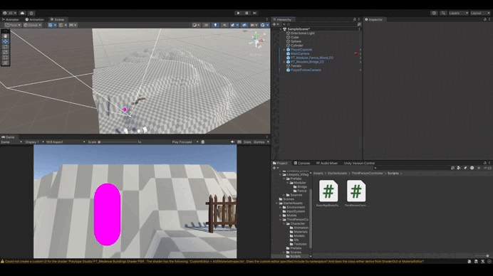
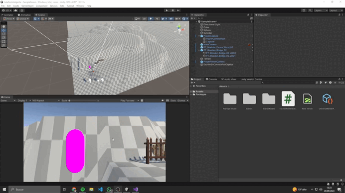

# Memoria Práctica P01 - Interfaces Inteligentes
## Autor: Juan Aday Siverio González

### Descripción:

- *Incluir objetos 3D básicos*



- *Incluir  en el proyecto el paquete Starter Assets.*



He decidido añadir el *"Starter Asset de ThirdPerson"*. 

- *Incluir un objeto libre de la Asset Store que no sea de los Starter Assets.*



El paquete de assets que he decidido añadir para importar un objeto de otro paquete ha sido *"Polytope Studio"*.
Además una curiosidad con la que me puse a comprobar cosas fue la tecnología de LODs que es básicamente una tecnología para optimizar recursos principalmente, se basa en crear varios modelos con más detalle de calidad cada uno y así cuando estás lo suficiente lejos de un objeto renderizar el modelo que menor calidad tiene, ayudando al sistema a renderizar cosas de menor resolución.

- *Crear un terreno.*



Además de crear el terreno he trasteado con las opciones de pintado sobre el terreno.

- *Cada objeto debe tener una etiqueta que lo identifique.*


He creado las etiquetas: 
  + BasicObject3D
  + Terrain
  + ElementFromPolytopeStudio
  + ObjectWithOnlyScript

- *Utilizar prefabs de Starter Asset FPS o Third Person*


He configurado la cámara y he asociado al script de la camara del player el objeto del player como tal para que lo siga, además modifiqué los parametros para que aparezca desde la perspectiva que se ve.

- *Agregar un script que escriba en la consola la posición de cada objeto que hayas utilizado.*


```csharp
public class EscribirNombreObjetos : MonoBehaviour
{
  // Start is called before the first frame update
  void Start() { 
    ShowNameAndPositionOfAllObjects();
  }

  // Este método se encarga de Buscar todos los objetos que hayan que sean 
  // Del tipo GameObject, es decir, es una forma de encontrar todos los objetos
  // De la escena sin necesidad de asociar todos los objetos uno a uno.
  private void ShowNameAndPositionOfAllObjects() {
    GameObject[] todosLosObjetos = Object.FindObjectsOfType<GameObject>();
    PrintObjectsInfo(todosLosObjetos);
  }
  
  // Este método se encarga de imprimir el nombre y la posicion de cada objeto
  private void PrintObjectsInfo(GameObject[] objects) {
    foreach (GameObject obj in objects) {
      Debug.Log("  " + obj.name + ": " + obj.transform.position + " (position)");
    }
  }
}
```
Otra forma podría haber sido asociando cada objeto al script directamente y preguntando a cada GameObject asociado, aunque pienso que es preferible esta forma ya que resulta dinámico (cada vez que haya un objeto nuevo siempre se incluirá al imprimir su posición) y es más escalable, ya que no tienes que estar añadiendo objetos siempre cada vez que se añada un objeto

### Conclusión:
Realmente esta práctica ha resultado entretenida pero sencilla en mi caso puesto que he trabajado bastante con Unity previamente, tanto que he desarrollado un videojuego y lo he subido en la **plataforma de videojuegos Steam**.  


*Enlace a ["Why God?"](https://store.steampowered.com/app/2565000/Why_God/)*