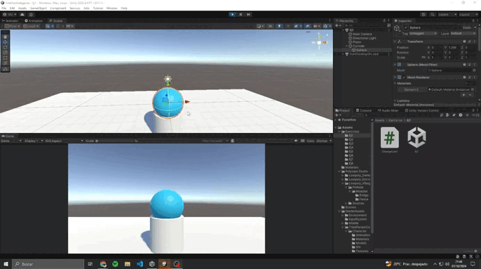
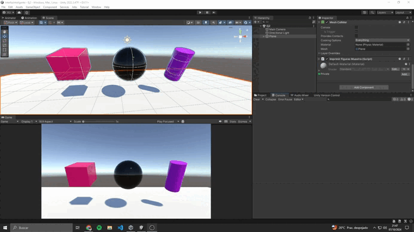
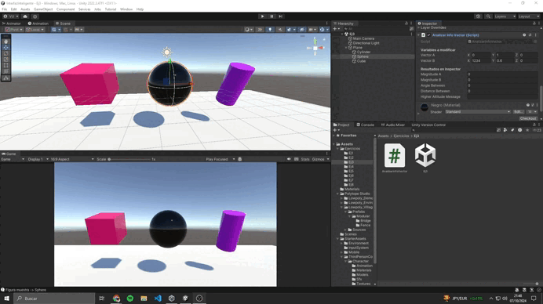
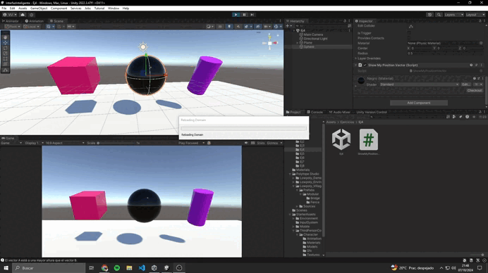
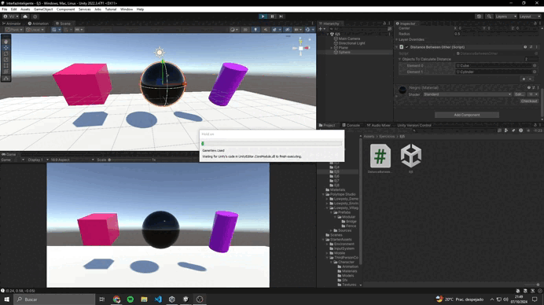
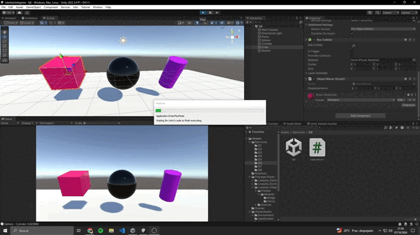
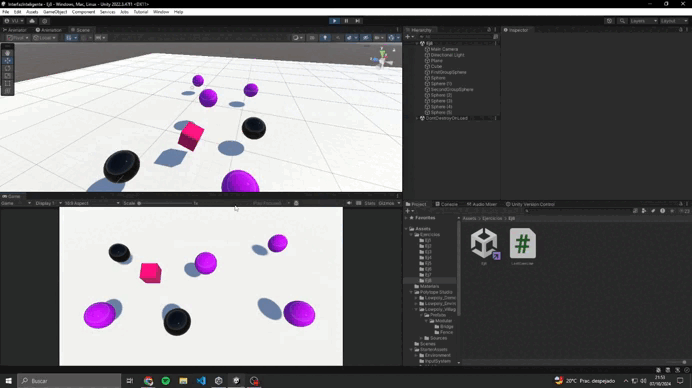

# Memoria Práctica P02 - Interfaces Inteligentes
## Autor: Juan Aday Siverio González

### Descripción:

---

1. *Crea un script asociado a un objeto en la escena que inicialice un vector de 3 posiciones con valores entre 0.0 y 1.0, para tomarlo como un vector de color (Color). Cada 120 frames se debe cambiar el valor de una posición aleatoria y asignar el nuevo color al objeto. Parametrizar la cantidad de frames de espera para poderlo cambiar desde el inspector.*

---

2. *Crea una escena simple en la que ubiques un plano y sobre él un cubo, una esfera y un cilindro. Cada uno de los objetos debe estar en un color diferente. En la consola cada objeto debe mostrar su nombre*

He decidido añadir el *"Starter Asset de ThirdPerson"*. 

---

3. *Crea un script asociado a la esfera con dos variables Vector3 públicas. Dale valor a cada componente de los vectores desde el inspector. Muestra en la consola:*
- *La magnitud de cada uno de ellos*
- *El ángulo que forman*
- *La distancia entre ambos.*
- *Un mensaje indicando qué vector está a una altura mayor.*
*Muestra en el inspector cada uno de esos valores.*

El paquete de assets que he decidido añadir para importar un objeto de otro paquete ha sido *"Polytope Studio"*.
Además una curiosidad con la que me puse a comprobar cosas fue la tecnología de LODs que es básicamente una tecnología para optimizar recursos principalmente, se basa en crear varios modelos con más detalle de calidad cada uno y así cuando estás lo suficiente lejos de un objeto renderizar el modelo que menor calidad tiene, ayudando al sistema a renderizar cosas de menor resolución.

---

4. *Muestra en pantalla el vector con la posición de la esfera.*

Además de crear el terreno he trasteado con las opciones de pintado sobre el terreno.

---

5. *Crea un script para la esfera que muestre en consola la distancia a la que están el cubo y el cilindro.*

He creado las etiquetas: 
  + BasicObject3D
  + Terrain
  + ElementFromPolytopeStudio
  + ObjectWithOnlyScript

---

6. *Selecciona tres posiciones en tu escena a través de un objeto invisible (marcador) que incluya 3 vectores numéricos para configurar posiciones en las que quieres ubicar los objetos en respuesta a pulsar la barra espaciadora. Estos vectores representan un desplazamiento respecto a la posición original del objeto. Crea un script que ubique en las posiciones configuradas cuando el usuario pulse la barra espaciadora.*

He configurado la cámara y he asociado al script de la camara del player el objeto del player como tal para que lo siga, además modifiqué los parametros para que aparezca desde la perspectiva que se ve.

---

7. *Cambia el color del cilindro cuando el usuario pulse la tecla C, cambia el color del cubo cuando el usuario pulse la flecha arriba.*

o siga, además modifiqué los parametros para que aparezca desde la perspectiva que se ve.

---

8. *Agrega 5 esferas más en la escena. Crea un grupo de 2 , asígnales la misma etiqueta para indicar esferas de tipo 1 y a las restantes otra etiqueta diferente a ésta para indicar esferas de grupo 2. En la escena también habrá un cubo. Implementa un script que aumente la altura de la esfera de tipo 2 más cercana al cubo. Cambia el color de la más lejana cuando el jugador pulsa la tecla espacio.*

o siga, además modifiqué los parametros para que aparezca desde la perspectiva que se ve.

---

### Conclusión:
